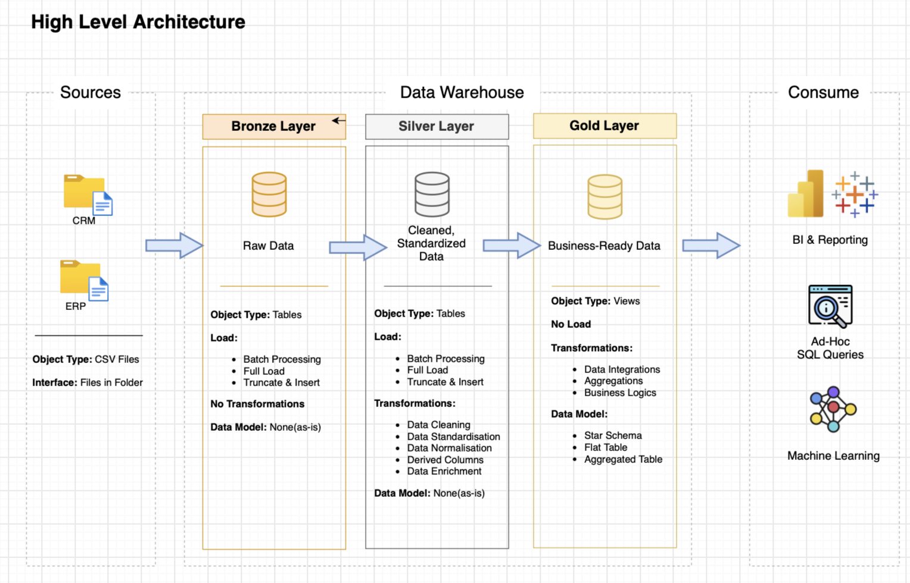

# 📊 Data Warehouse & Analytics Project

An end-to-end modern data warehouse over customer, sales, and product data, built from raw source files to analytics-ready star-schema models. I built this to get hands-on with the full data engineering workflow: data architecture, ETL, data modeling, and SQL analytics, showing command of each stage of the pipeline.

---

## 🏗️ Data Architecture

This project follows the **Medallion Architecture** with **Bronze**, **Silver**, and **Gold** layers:

- **Bronze Layer** — Stores raw data exactly as it comes from the source systems. Data is ingested from CSV files into a SQL Server database, with no transformation, so I always have an untouched copy for traceability.
- **Silver Layer** — Handles data cleansing, standardization, and normalization to get the data into a consistent, analysis-ready state.
- **Gold Layer** — Contains business-ready data modeled into a **star schema** for reporting and analytics.


> 

---

## 📖 What This Project Covers

- **Data Architecture** — Designing a modern warehouse using the Medallion (Bronze / Silver / Gold) approach.
- **ETL Pipelines** — Extracting, transforming, and loading data from source systems into the warehouse.
- **Data Modeling** — Building fact and dimension tables optimized for analytical queries.
- **Analytics & Reporting** — Writing SQL to turn the modeled data into actionable insights.

---

## 🎯 Skills I'm Practicing Here

- SQL development (T-SQL)
- Data architecture & warehouse design
- ETL pipeline development
- Dimensional data modeling (star schema)
- Data quality checks
- Analytics & reporting

---

## 🛠️ Tools Used

- **SQL Server Express** — Lightweight server for hosting the database.
- **SQL Server Management Studio (SSMS)** — GUI for managing and querying the databases.
- **Git & GitHub** — Version control and hosting this project.
- **draw.io** — Designing the data architecture, data flow, and data model diagrams.
- **Notion** — Planning the project, tracking tasks, and documenting each phase.

---

## 🚀 Project Requirements

### Building the Data Warehouse (Data Engineering)

**Objective:** Build a data warehouse in SQL Server that consolidates sales data from multiple sources, so it can support analytical reporting and better decision-making.

**Specifications:**
- **Data Sources:** Import data from two source systems — **ERP** and **CRM** — provided as CSV files.
- **Data Quality:** Cleanse and resolve data quality issues before analysis.
- **Integration:** Combine both sources into a single, user-friendly model built for analytical queries.
- **Scope:** Focus on the latest dataset only — no historization required.
- **Documentation:** Document the data model clearly so it's understandable to both business and analytics readers.

### BI: Analytics & Reporting (Data Analysis)

**Objective:** Use SQL to produce insights into:
- Customer behavior
- Product performance
- Sales trends

> 

---

## 📂 Repository Structure
```
data-warehouse-project/
│
├── datasets/                     # Raw datasets (ERP and CRM CSV files)
│
├── docs/                         # Documentation and architecture diagrams
│   ├── data_architecture.drawio  # Overall project architecture
│   ├── data_flow.drawio          # Data flow diagram
│   ├── data_models.drawio        # Star schema data models
│   ├── etl.drawio                # ETL techniques and methods
│   ├── data_catalog.md           # Dataset catalog with field descriptions
│   ├── naming-conventions.md     # Naming guidelines for tables, columns, and files
│
├── scripts/                      # SQL scripts for ETL and transformations
│   ├── bronze/                   # Extract & load raw data
│   ├── silver/                   # Clean & transform data
│   ├── gold/                     # Build analytical (star schema) models
│
├── tests/                        # Data quality checks and test scripts
│
├── README.md                     # Project overview (this file)
└── .gitignore                    # Files ignored by Git
```

## 👋 About Me

Hi there! I'm **Lu**, a **Business Intelligence / Data Analytics** professional passionate about transforming raw data into insights that drive decisions. This project demonstrates my command of the full data workflow, from data modeling and ETL to SQL analytics.

Feel free to connect with me:

[](https://www.linkedin.com/in/christinaluliu/)
